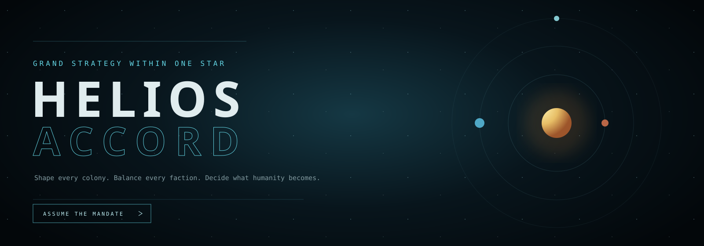
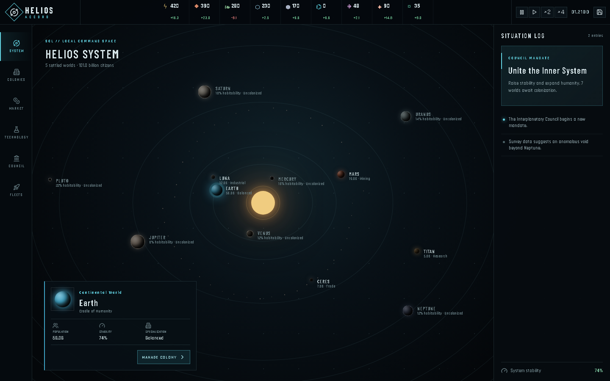
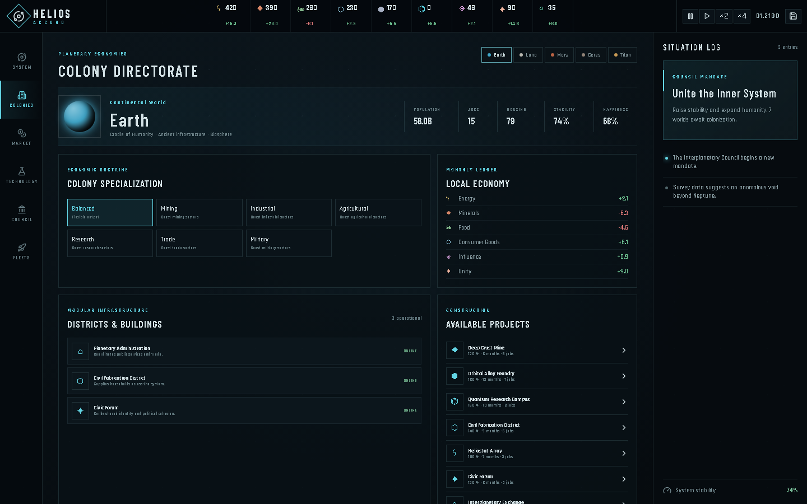
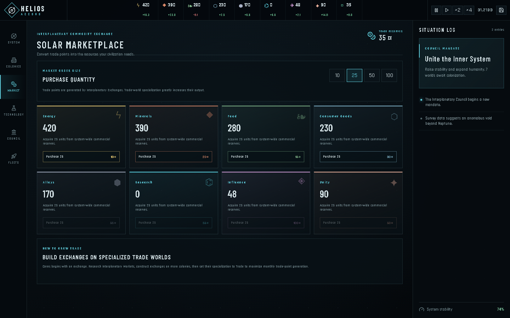
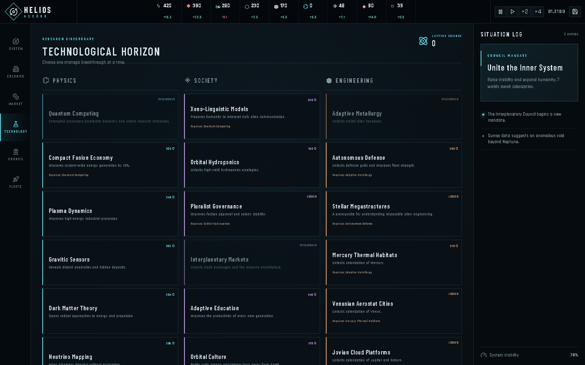
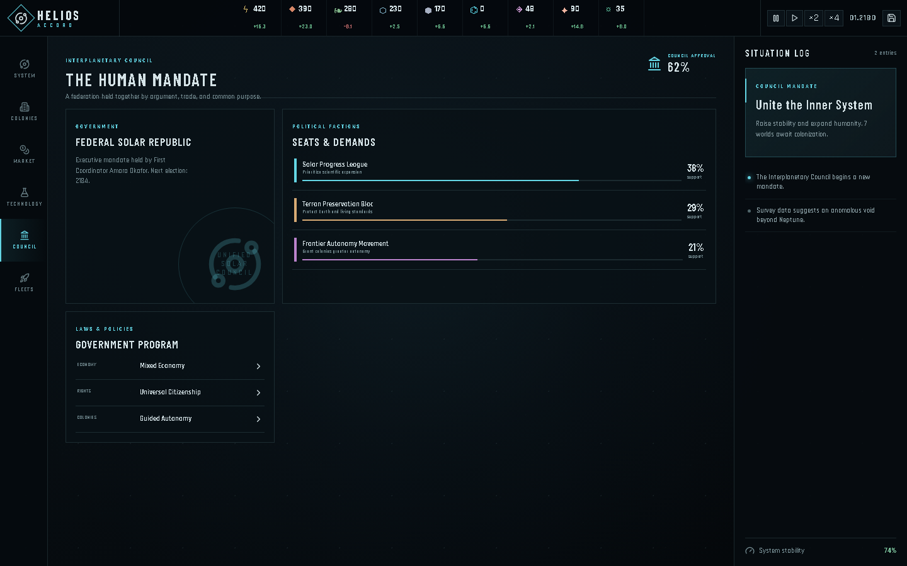
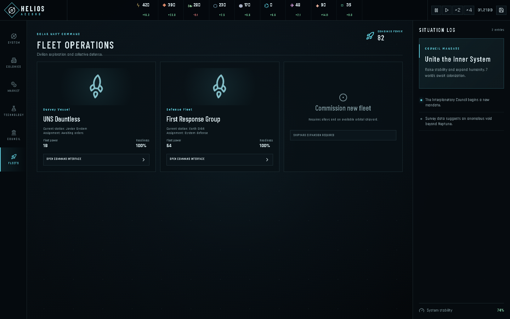
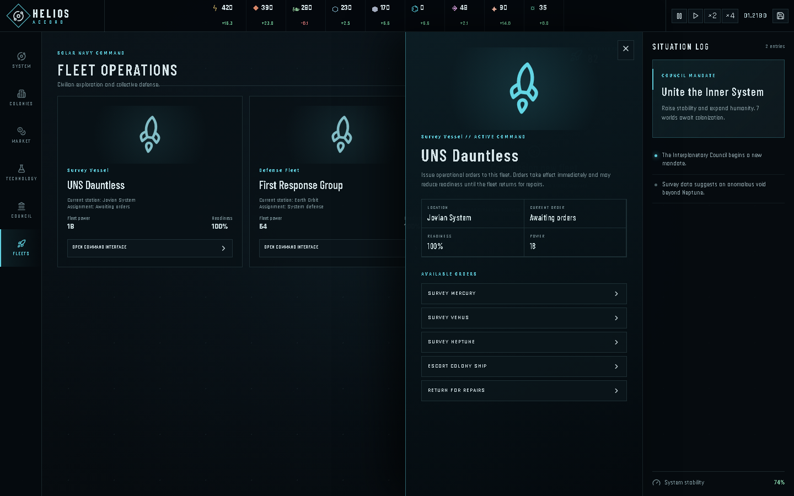

<div align="center">
  

  <h1>Helios Accord</h1>
  <p><strong>A playable grand-strategy game about governing humanity across one living solar system.</strong></p>

  <p>
    <code>React 19</code>
    <code>TypeScript</code>
    <code>Vite</code>
    <code>Vitest</code>
    <code>Local Saves</code>
  </p>
</div>

Helios Accord puts the player in command of an emerging interplanetary civilization. Every colony has its own population, infrastructure, specialization, output, and political pressures. Decisions made on one world ripple through the entire system: industrial expansion consumes minerals, trade worlds finance emergency purchases, technologies unlock hostile environments, and political choices determine whether humanity remains united long enough to face what waits beyond Neptune.

## Core Capabilities

| System | What You Can Do | Strategic Consequence |
| --- | --- | --- |
| Solar-system command | Inspect every planet from Mercury to Neptune, plus Pluto, Luna, Ceres, and Titan | See settled worlds, habitability, orbital position, and expansion opportunities |
| Modular colony economy | Specialize colonies, construct buildings, track jobs, housing, stability, and local ledgers | Each world becomes a deliberate part of the wider economy |
| Interplanetary marketplace | Spend trade points to purchase energy, minerals, food, goods, alloys, research, influence, or unity | Trade worlds provide a flexible answer to shortages and crises |
| Long-term research | Select from 56 technologies across Physics, Society, and Engineering | Unlock buildings, colonization environments, new efficiencies, and alien-contact readiness |
| Colonization | Establish settlements on Mercury, Venus, Jupiter, Saturn, Uranus, Neptune, and Pluto | Expansion costs alloys and influence and requires environment-specific technologies |
| Political simulation | Monitor factions, approval, demands, laws, and system-wide stability | Political decisions can strengthen unity or destabilize every colony |
| Fleet command | Open command interfaces, survey planets, patrol regions, escort colony ships, and repair fleets | Orders change fleet location, assignment, readiness, and strategic coverage |
| Dynamic events | Respond to political crises, discoveries, labor disputes, hazards, economic booms, and first contact | Choice-driven events alter resources, stability, research, and the direction of the run |
| Endgame contact | Investigate the Silent Geometry and answer an advanced civilization's invitation | Reach multiple endings based on humanity's choices and development |
| Campaign persistence | Pause, change simulation speed, and save locally | Continue a decades- or centuries-long campaign in the browser |

## Solar-System Command



The command map presents the whole strategic theater in one view. Every major planet is shown in its orbital position, while important settled moons and dwarf planets remain visible as independent economic centers.

- Round, visually distinct celestial bodies reflect each world's identity.
- Settled worlds display population and economic specialization.
- Uncolonized planets expose habitability and expansion status.
- The situation log tracks recent decisions, discoveries, and strategic objectives.
- The top resource bar shows current reserves and monthly income or losses.

## Colony Directorate



Every colony is a modular economy rather than a passive resource node.

- Choose between Balanced, Mining, Industrial, Agricultural, Research, Trade, and Military specializations.
- Inspect local production and consumption through a monthly ledger.
- Construct mines, foundries, hydroponics arcologies, research campuses, civic forums, defense grids, solar arrays, and trade exchanges.
- Track population, jobs, housing, happiness, and stability.
- Review every expansion target from the Colonization Directorate.

Trade specialization is especially important: an Interplanetary Exchange produces trade points, and a Trade world significantly increases that output.

## Solar Marketplace



The marketplace converts commercial strength into strategic flexibility.

- Select purchase quantities of 10, 25, 50, or 100 units.
- Purchase any core resource using trade points.
- Compare live prices against current trade reserves.
- Use trade to escape shortages, accelerate construction, finance research, or prepare for political events.

Trade points are generated monthly by trade buildings and amplified by Trade-world specialization.

## Technological Horizon



The research catalog contains **56 technologies** divided across three disciplines:

- **Physics:** fusion, quantum communication, gravitic sensors, stellar weather, dark matter, exotic matter, and deep-space observation.
- **Society:** governance, migration, synthetic ecology, cultural unity, longevity, xenopsychology, and transhuman consensus.
- **Engineering:** robotic workforces, foundries, shipyards, planetary shields, megastructures, and environment-specific colonization.

Research cards display costs, prerequisites, unlocks, and completion status. Environment technologies form the backbone of expansion, gradually making increasingly hostile worlds colonizable.

## Interplanetary Council



Humanity is governed through a federal solar republic whose factions disagree about expansion, autonomy, scientific risk, and life on Earth.

- Monitor faction support, approval, and current demands.
- Change economic, citizenship, and colonial-autonomy policies.
- Spend influence to redirect the government's program.
- Protect system stability to prevent strikes, unrest, and political fragmentation.

## Fleet Operations



Civilian and military fleets provide exploration, protection, and logistical support. Each fleet tracks its power, readiness, current station, and active assignment.

## Fleet Command Interfaces



Every fleet's **Open Command Interface** button opens a functional command drawer.

- Survey Mercury, Venus, Neptune, and other strategic targets.
- Patrol the Inner System, Belt Corridor, or Outer System.
- Escort colony ships through dangerous transit corridors.
- Return to Earth orbit for repairs and readiness restoration.
- See orders immediately update fleet location, readiness, and the situation log.

## Dynamic Events And First Contact

Campaigns are interrupted by recurring choice-driven events after periods of relative calm. Current event families include:

- Labor disputes and political referendums
- Habitat failures and solar storms
- Artificial-intelligence citizenship debates
- Economic booms and military-doctrine disputes
- Extraterrestrial microbial discoveries
- Signals beneath Europa's ice
- Ancient human relics recovered in deep space

Decades into a sufficiently advanced campaign, a silent geometric object appears beyond Neptune. The resulting first-contact chain tests humanity's scientific readiness, political unity, and willingness to change. The campaign can end in ascension, a negotiated accord, or an independent human future.

## Running Locally

```powershell
npm install
npm run dev
```

Open the local URL printed by Vite, then select **Assume the Mandate**.

## Windows Desktop App

Helios Accord is also packaged as a lightweight native Windows application using **Tauri 2** and the system WebView2 runtime. This keeps the download substantially smaller than an Electron bundle while preserving the complete game.

Download the latest Windows installer or portable executable from the [GitHub Releases page](https://github.com/benclawbot/Helios-Accord/releases/latest):

- **Installer:** [`Helios.Accord_1.0.0_x64-setup.exe`](https://github.com/benclawbot/Helios-Accord/releases/download/v1.0.0/Helios.Accord_1.0.0_x64-setup.exe)
- **Portable app:** [`helios-accord.exe`](https://github.com/benclawbot/Helios-Accord/releases/download/v1.0.0/helios-accord.exe)

To build the Windows application locally:

```powershell
npm install
npm run desktop:build
```

The packaged artifacts are written to:

```text
src-tauri/target/release/helios-accord.exe
src-tauri/target/release/bundle/nsis/Helios Accord_1.0.0_x64-setup.exe
```

## Validation

```powershell
npm test
npm run build
```

The deterministic simulation engine is covered by tests for construction, research, marketplace purchases, colonization, recurring events, late-game contact conditions, and fleet orders.

## Screenshot Automation

The repository includes a Playwright capture script that regenerates every README screenshot from the live game:

```powershell
npm run dev
node scripts/capture-screenshots.mjs
```
